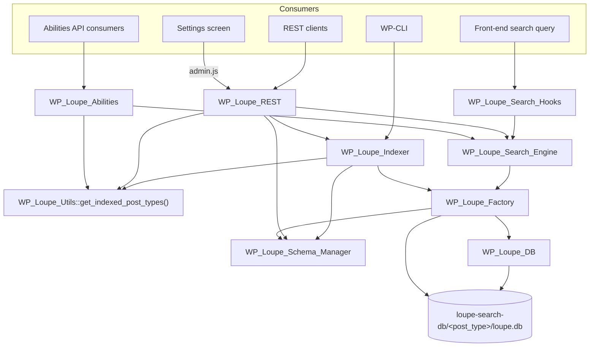

# Architecture

Current state of Loupe Search as implemented in this repository. Every claim
below is traceable to a named symbol in `includes/`.

## Contents

- [Purpose](#purpose)
- [Scope](#scope)
- [Major components](#major-components)
- [Request routing](#request-routing)
- [Flow: front-end search](#flow-front-end-search)
- [Flow: indexing a saved post](#flow-indexing-a-saved-post)
- [Flow: batched reindex](#flow-batched-reindex)
- [Boundaries and constraints](#boundaries-and-constraints)
- [Invariants](#invariants)
- [Persistent state](#persistent-state)
- [Where to make changes](#where-to-make-changes)
- [Deprecated code](#deprecated-code)

## Purpose

Loupe Search maintains one [Loupe](https://github.com/loupe-php/loupe) SQLite
index per configured post type and exposes it to three consumers: the WordPress
front-end search query, a REST API, and the WordPress Abilities API. Indexing is
incremental on `save_post` and can be rebuilt in full or in batches from the
admin Dashboard or WP-CLI.

## Scope

Included:

- Per-post-type index lifecycle: create, incremental update, delete, rebuild.
- Field schema configuration (weight, filterable, sortable) per post type.
- Query interception for the front-end WordPress search.
- A public search REST API and an admin-only management REST API.
- Abilities API registration for agent/automation consumers.
- A single admin settings screen with index health and a batched reindex runner.

Not included:

- A front-end search UI. The plugin ships no blocks or shortcodes; the block
  editor integration was removed (`tests/WP_Loupe_Blocks_EditorTest.php` is
  skipped with "WP Loupe no longer ships the block editor integration").
- Admin-side search over posts, users, comments and plugins. That is the
  separate `wp-loupe-admin-search` add-on, which writes its own indexes under
  `<db path>/admin/`.
- Indexing of non-published content. See [Invariants](#invariants).
- A plugin update channel. See
  [ADR 0001](adr/0001-defer-auto-updates-to-core.md).
- An MCP server. Removed in 0.8.5; see
  [migration-mcp-to-abilities.md](migration-mcp-to-abilities.md).

## Major components

| Component | Responsibility | Implementation | Depends on |
|---|---|---|---|
| Bootstrap | Defines `WP_LOUPE_*` constants, gates unwanted request types, boots the loader on `plugins_loaded` | [loupe-search.php](../loupe-search.php) | `WP_Loupe_Loader`, `WP_Loupe_Utils` |
| Loader | Requires every class file and wires the runtime components | [includes/class-wp-loupe-loader.php](../includes/class-wp-loupe-loader.php) | all components below |
| Path resolver | Resolves the index base directory and per-post-type directory; deletes the index tree | [includes/class-wp-loupe-db.php](../includes/class-wp-loupe-db.php) | `loupe_search_db_path` filter |
| Engine factory | Builds and caches a configured `Loupe\Loupe\Loupe` per post type, and decides which fields may be sortable | [includes/class-wp-loupe-factory.php](../includes/class-wp-loupe-factory.php) | `loupe/loupe`, `wp_loupe_fields`, `wp_loupe_advanced` |
| Schema manager | Turns saved field settings into indexable / filterable / sortable field lists, with per-request caching | [includes/class-wp-loupe-schema-manager.php](../includes/class-wp-loupe-schema-manager.php) | `wp_loupe_fields` |
| Indexer | Document preparation, incremental add/delete, full and batched reindex, on-disk column repair | [includes/class-wp-loupe-indexer.php](../includes/class-wp-loupe-indexer.php) | factory, path resolver, schema manager |
| Search engine | Side-effect-free querying, result caching, index-readiness probing | [includes/class-wp-loupe-search-engine.php](../includes/class-wp-loupe-search-engine.php) | factory, path resolver |
| Search hooks | Front-end `WP_Query` interception and footer timing comment | [includes/class-wp-loupe-search-hooks.php](../includes/class-wp-loupe-search-hooks.php) | search engine |
| REST controller | Route registration in two namespaces, request validation, allowlisting, response shaping | [includes/class-wp-loupe-rest.php](../includes/class-wp-loupe-rest.php) | search engine, schema manager, indexer |
| Abilities | Registers `loupe-search/search` and `loupe-search/get-post` (plus deprecated aliases) | [includes/class-wp-loupe-abilities.php](../includes/class-wp-loupe-abilities.php) | search engine |
| Settings screen | Settings → Loupe Search page, option registration and sanitization, admin assets | [includes/class-wp-loupe-settings.php](../includes/class-wp-loupe-settings.php) | factory, REST controller (via admin JS) |
| CLI | `wp loupe-search reindex` | [includes/class-wp-loupe-cli.php](../includes/class-wp-loupe-cli.php) | indexer |
| Utilities | Post-type resolution, environment checks, debug logging, transient purging | [includes/class-wp-loupe-utils.php](../includes/class-wp-loupe-utils.php) | — |

All classes live in the `Soderlind\Plugin\WPLoupe` namespace. Class names and
the `WP_LOUPE_*` constants retain the historic `WP_Loupe` prefix; see
[renamed-from-wp-loupe.md](renamed-from-wp-loupe.md).

## Request routing

`init()` in [loupe-search.php](../loupe-search.php) returns early — so nothing
is wired at all — for autosaves, heartbeat AJAX and cron.

`WP_Loupe_Loader::init_components()` then decides which integrations attach:

| Integration | Attached when |
|---|---|
| `WPLoupe_Settings_Page` | always |
| `WP_Loupe_Search_Engine` | always |
| `WP_Loupe_Search_Hooks` | `( ! is_admin() \|\| wp_doing_ajax() )` and not `REST_REQUEST` and not `WP_CLI` |
| `WP_Loupe_Indexer` | always |
| `WP_Loupe_REST` | always |
| `WP_Loupe_Abilities` | always; it only attaches to `wp_abilities_api_init`, so registration happens only where the WordPress 6.9+ Abilities API is present |

The indexed post-type list is resolved by
`WP_Loupe_Utils::get_indexed_post_types()`, which reads
`get_option( 'wp_loupe_custom_post_types' )['wp_loupe_post_type_field']`,
defaults to `[ 'post', 'page' ]`, then applies `loupe_search_post_types`. The
loader, indexer, REST controller and abilities all call it, so the filter has
the same effect on every surface. The settings screen deliberately reads the
raw option instead, so the checkboxes always show what is stored.

## Flow: front-end search

Trigger: a front-end `WP_Query` search.

1. `WP_Loupe_Search_Hooks::posts_pre_query()` runs on the `posts_pre_query`
   filter.
2. `should_intercept_query()` bails unless this is a front-end main search query
   (or any AJAX search query). If the query names explicit post types and any of
   them is not indexed, it bails so WordPress can answer the query itself.
3. `prepare_search_term()` joins `search_terms`, wrapping multi-word terms in
   quotes for phrase matching.
4. `WP_Loupe_Search_Engine::search()` checks the `wp_loupe_search_<md5>`
   transient, then queries every configured post type's Loupe instance and
   merges the hits. Loupe's `_rankingScore` is copied to `_score`, and
   `post_type` is stamped on each hit. Results are cached for one hour
   (`CACHE_TTL`).
5. `create_post_objects()` loads the matching `WP_Post` objects with
   `orderby => post__in` to preserve relevance order, and attaches every
   filterable or sortable field as a dynamic property.
6. `posts_pre_query()` slices the result to the current page, sets
   `found_posts`, `max_num_pages` and `is_paged` on the query, and returns the
   page. Page size comes from `loupe_search_posts_per_page`.
7. `action_wp_footer()` prints the accumulated Loupe processing time as an HTML
   comment.

Failure behavior:

| Failure | Behavior | Retry owner |
|---|---|---|
| Loupe throws for one post type | Logged via `WP_Loupe_Utils::debug_log()`, that post type contributes no hits, other post types still return | none |
| Sort attribute rejected by Loupe | Logged, the search re-runs without sorting | none |
| Query is not interceptable | `posts_pre_query()` returns `null`, WordPress runs its own SQL search | WordPress |

Ranking is computed per post type and the merged list is **not** re-ranked
across post types in this path; `WP_Loupe_REST::handle_search_request_post()`
sorts the merged set explicitly.

## Flow: indexing a saved post

Trigger: `save_post_{$post_type}` for each configured post type.

1. `WP_Loupe_Indexer::add()` calls `is_indexable()`, which rejects revisions,
   autosaves, unconfigured post types, non-`publish` statuses, and
   password-protected posts unless `loupe_search_index_protected` says otherwise.
2. All `wp_loupe_search_*` transients are deleted via
   `WP_Loupe_Utils::remove_transient()`, invalidating both the simple and
   advanced search caches.
3. `prepare_document()` builds the document: `id` (the post ID) and `post_type`,
   then every indexable field resolved from — in order — a `WP_Post` property
   (passed through `loupe_search_field_{$field_name}`), a `taxonomy_<name>`
   term-name array, or post meta. Values are normalized by
   `sanitize_field_value()` to `null`, a number, a string, an array of strings,
   or a `{ lat, lng }` geo point. Sortable fields absent from the document are
   backfilled with `""` so the attribute always exists.
4. `Loupe::addDocument()` writes to
   `<db path>/<post_type>/loupe.db`.

Trashing is handled by `trash_post()` on `wp_trash_post`, which only acts when
the previous status was `publish`, verifies the `bulk-posts` nonce for bulk
operations, and routes to `deleteDocument()` or `deleteDocuments()`.

Loupe 0.13 changed the internal document schema. `delete()` and `delete_many()`
therefore call `maybe_migrate_loupe_before_delete()` first — which indexes the
current document to trigger Loupe's own migration — and retry once if the
exception message matches `LOUPE_SCHEMA_MISMATCH_SUBSTRINGS`
(`no such column: _user_id`, `no such column: _id`). A second failure is logged
and swallowed.

## Flow: batched reindex

Trigger: `POST /wp-json/loupe-search/v1/reindex-batch` from the Dashboard's
reindex panel, or `wp loupe-search reindex`.

1. `WP_Loupe_Indexer::reindex_batch_init()` repairs missing columns
   (`ensure_required_columns()`), purges search transients, writes default field
   settings when missing, clears the factory and schema caches, rebuilds the
   Loupe instances, and returns a state array
   (`post_types`, `idx`, `last_id`, `cleared`, `processed`, `processed_pt`).
2. `reindex_batch_step()` processes one batch (10–2000 posts, default 500). The
   first step for a post type clears its index: if `Loupe::needsReindex()` is
   true, or `deleteAllDocuments()` raises a schema-mismatch error, the on-disk
   directory is deleted outright by `delete_index_for_post_type()` and the
   instance is rebuilt.
3. Posts are fetched by keyset pagination — a prepared
   `SELECT ID … WHERE ID > %d ORDER BY ID ASC LIMIT %d` in
   `get_published_post_ids_after()` — so large sites never issue a large-offset
   query.
4. The REST handler returns the updated state as a cursor, signed with
   `hash_hmac( 'sha256', $payload, wp_salt( 'auth' ) )` and compared with
   `hash_equals()` on the next request. A cursor that fails verification or
   carries a different `REINDEX_CURSOR_VERSION` is discarded and the run
   restarts.
5. The caller loops until the response reports `done`.

`reindex_all()` performs the same work synchronously in one request and is used
by the legacy `admin_init` form handler (`handle_reindex()`, guarded by the
`wp_loupe_nonce_action` nonce).

Failure behavior:

| Failure | Behavior | Retry owner |
|---|---|---|
| Batch step throws | REST returns `wp_loupe_reindex_failed` (HTTP 500); the last valid cursor is still held by the client | caller |
| Cursor tampered with or stale version | Cursor rejected, a fresh run is initialized | system |
| `ensure_required_columns()` cannot open the SQLite file | Silently ignored; the index is rebuilt from scratch on schema mismatch | system |

## Boundaries and constraints

- **Query vs. engine.** `WP_Loupe_Search_Engine` registers no hooks and must
  stay side-effect free; all WordPress query integration lives in
  `WP_Loupe_Search_Hooks`. Enforced by convention and asserted by
  [tests/WP_Loupe_Search_HooksTest.php](../tests/WP_Loupe_Search_HooksTest.php).
- **Front-end only interception.** `WP_Loupe_Search_Hooks` is never constructed
  during REST, WP-CLI or non-AJAX admin requests, so admin list tables keep
  WordPress' own search.
- **Persistence boundary.** Index data lives in SQLite files outside MySQL and
  is accessed only through `Loupe\Loupe\Loupe`, except for two deliberate `PDO`
  escapes: `ensure_required_columns()` in the indexer and the version probe in
  `WP_Loupe_Utils::get_sqlite_version_string()`. There is no transaction that
  spans MySQL and the index.
- **Trust boundary — public REST.** `GET /search` and `POST /search` use
  `permission_callback => '__return_true'` and are unauthenticated. All other
  routes require `manage_options`. Untrusted input becomes trusted in
  `handle_search_request_post()`, which:
  - rejects post types not in the configured list and not index-ready;
  - validates every attribute name against
    `WP_Loupe_Search_Engine::is_valid_loupe_attribute_name()`;
  - requires filter, facet and geo fields to be filterable in **every**
    requested post type (`get_common_allows()` intersects the sets);
  - accepts only the operators `eq, ne, in, nin, lt, lte, gt, gte, between,
    exists` in `build_filter_string()`;
  - drops unknown highlight/crop fields silently and passes highlight tags
    through `wp_kses()` with an inline-formatting allowlist
    (`sanitize_highlight_tag()`).
- **Pagination ceiling.** `POST /search` rejects requests where
  `offset + size > 1000`, and `WP_Loupe_Search_Engine::search()` caps Loupe at
  `withLimit( 1000 )`. Deep pagination is not supported.
- **Cache coherence.** Every index write purges the `wp_loupe_search_` transient
  prefix. Because the advanced cache key is `wp_loupe_search_adv_<md5>`, the
  prefix purge covers it too.
- **No cross-post-type ranking in the query path.** See
  [Flow: front-end search](#flow-front-end-search).

## Invariants

### The index contains only published, indexable posts

Rule: a document exists in `<post_type>/loupe.db` only for a post of that type
whose status is `publish`, which is not a revision or autosave, and which is
either unprotected or admitted by `loupe_search_index_protected`.

Enforced by `WP_Loupe_Indexer::is_indexable()` on write,
`post_status => 'publish'` in `reindex_all()` and
`get_published_post_ids_after()`, and `trash_post()` on removal.

Every read path re-checks the status of each hit, so a stale index degrades to
missing results rather than leaking drafts:
`WP_Loupe_REST::handle_search_request_post()` and `perform_search()`,
`WP_Loupe_Abilities::execute_search()` and `execute_get_post()`, and
`WP_Loupe_Search_Hooks::create_post_objects()`, which hydrates hits with
`get_posts()` and therefore inherits its `publish`-only default.

### The document primary key is the post ID

Rule: `Configuration::withPrimaryKey( 'id' )` and `prepare_document()` sets
`id => $post->ID`. Deletes address documents by post ID.

Enforced by `WP_Loupe_Factory::build_configuration()` and
`WP_Loupe_Indexer::prepare_document()`.

### Sortable attributes are scalar or geo points

Rule: an attribute may be declared sortable only if it is a known scalar core
field, or a meta field whose sampled values are scalar or a valid
`{ lat, lng }` geo point.

Enforced by `WP_Loupe_Factory::is_safely_sortable()` and
`check_meta_field_sortability()`, which samples five posts.
`validate_sortable_fields()` rewrites and re-saves `wp_loupe_fields` when a
setting violates this. Overridable per site through
`loupe_search_is_safely_sortable_{$post_type}` and
`loupe_search_is_safely_sortable_meta_{$post_type}`.

Verified by
[tests/WP_Loupe_Factory_GeoSortableTest.php](../tests/WP_Loupe_Factory_GeoSortableTest.php).

### `post_date` is always in the schema

Rule: `post_date` is indexable, filterable and sortable for every post type,
independent of saved settings. It is the only field in the baseline schema.

Enforced by `WP_Loupe_Schema_Manager::get_default_schema()`. Older indexes are
repaired by `WP_Loupe_Indexer::ensure_required_columns()`, which adds the SQLite
column and its index if missing.

Verified by
[tests/SchemaManagerTest.php](../tests/SchemaManagerTest.php) and
[tests/WP_Loupe_Schema_ManagerTest.php](../tests/WP_Loupe_Schema_ManagerTest.php).

### Every surface resolves the same post-type list

Rule: the indexer, the REST controller, the abilities and the front-end query
integration all operate on one list, so `loupe_search_post_types` cannot make a
post type searchable without also making it indexed.

Enforced by `WP_Loupe_Utils::get_indexed_post_types()`, the single reader of
`wp_loupe_custom_post_types` outside the settings screen. `WPLoupe_Settings_Page`
is the deliberate exception: it reads the raw option so the checkboxes show what
is stored rather than what the filter produced.

Verified by
[tests/WP_Loupe_UtilsTest.php](../tests/WP_Loupe_UtilsTest.php).

### Renamed hooks, routes, commands and abilities keep working

Rule: every public name renamed in 1.1.0/1.2.0 still resolves under its old
name.

Enforced by paired `apply_filters()` + `apply_filters_deprecated()` calls for
all eight filters, a `foreach` over
`[ 'loupe-search/v1', 'wp-loupe/v1' ]` in `WP_Loupe_REST::on_rest_api_init()`,
duplicate ability registration in `WP_Loupe_Abilities::register_abilities()`,
and a second `WP_CLI::add_command( 'wp-loupe', … )` with a deprecation warning.

Verified for abilities by
[tests/WP_Loupe_AbilitiesTest.php](../tests/WP_Loupe_AbilitiesTest.php).

## Persistent state

| Data | Location | Owner | Removed on uninstall |
|---|---|---|---|
| Search indexes | `wp-content/loupe-search-db/<post_type>/loupe.db` | `WP_Loupe_DB`, `WP_Loupe_Factory` | yes, including the legacy `wp-loupe-db` directory |
| Indexed post types | option `wp_loupe_custom_post_types` | settings screen | yes |
| Field settings | option `wp_loupe_fields` | settings screen, factory, indexer | yes |
| Search behavior settings | option `wp_loupe_advanced` | settings screen | yes |
| Result caches | transients `wp_loupe_search_*` | search engine, REST controller | yes |

`WP_Loupe_DB::get_base_path()` defaults to `WP_CONTENT_DIR . '/loupe-search-db'`
but falls back to the legacy `wp-loupe-db` directory when that exists and the
new one does not, so upgraded sites keep their indexes. The result is passed
through `loupe_search_db_path`; an empty or non-string filter return is ignored.

[uninstall.php](../uninstall.php) deletes both directories, the three options
and the cached search results. On multisite it repeats the option and transient
cleanup for every site.

## Where to make changes

| Change | Primary location | Also update |
|---|---|---|
| Add or change an indexed field's value | `WP_Loupe_Indexer::prepare_document()` | [docs/filters.md](filters.md) if a new filter is introduced |
| Change the default field schema | `WP_Loupe_Schema_Manager::get_default_schema()`, `WP_Loupe_Factory::get_field_configuration()` | `tests/SchemaManagerTest.php` |
| Change Loupe engine configuration (typo tolerance, tokenization, languages) | `WP_Loupe_Factory::build_configuration()` | settings fields in `WPLoupe_Settings_Page::wp_loupe_setup_fields()`, `sanitize_advanced_settings()` |
| Add a REST route or parameter | `WP_Loupe_REST::register_routes_for_namespace()` and its handler | [docs/search-api.md](search-api.md), `tests/WP_Loupe_REST_*` |
| Change how front-end search results are ordered or paginated | `WP_Loupe_Search_Hooks::posts_pre_query()` | `tests/WP_Loupe_Search_HooksTest.php` |
| Change which post types are indexed and searched | `WP_Loupe_Utils::get_indexed_post_types()` | `tests/WP_Loupe_UtilsTest.php` |
| Change where indexes are stored | `WP_Loupe_DB::get_base_path()` | `uninstall.php`, and the add-on's `WP_Loupe_Admin_Paths` |
| Add a settings field | `WPLoupe_Settings_Page::wp_loupe_setup_fields()` | matching `sanitize_*` method, `tests/WP_Loupe_SettingsTest.php` |
| Add an ability | `WP_Loupe_Abilities::register_abilities()` | `tests/WP_Loupe_AbilitiesTest.php` |
| Rename a public hook, route or command | the emitting call site | add an `apply_filters_deprecated()` / alias registration, and [docs/renamed-from-wp-loupe.md](renamed-from-wp-loupe.md) |

Run `composer test` (PHPUnit, WordPress functions mocked with Brain Monkey) or
`composer test:pest` after changes. There is no integration suite that exercises
a real Loupe index.

## Deprecated code

- `WP_Loupe_Search` ([includes/class-wp-loupe-search.php](../includes/class-wp-loupe-search.php))
  is deprecated since 0.6.0 and is never instantiated by the plugin. It is
  loaded by the loader and kept only for third-party code that constructs it
  directly.
- `WP_Loupe_REST::format_search_results()` is annotated in-code as retained for
  backward compatibility.

## Further reading

- [Search API](search-api.md) — endpoint and payload reference.
- [Filters](filters.md) — the eight extension points.
- [Renamed from WP Loupe](renamed-from-wp-loupe.md) — old names that still work.
- [Decisions](adr/) — architecture decision records.
